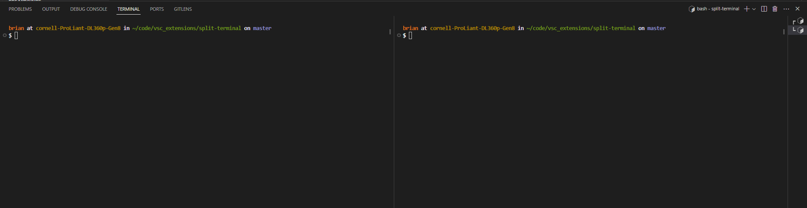

# split-terminal README

This is a simple VSC extension to automatically split your terminal to two window panes.

## Features

When opening VSC, your terminal panes should look like this:

## Release Notes

### 1.0.0

Initial release
